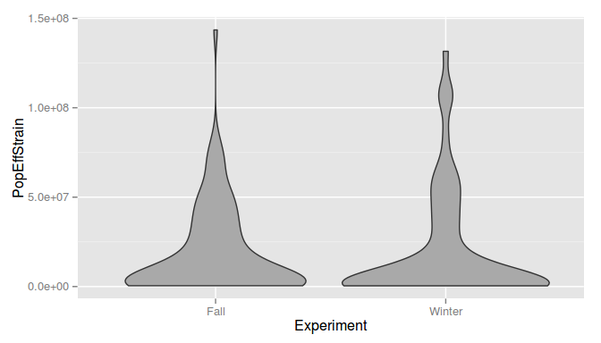

# Regus2014 Data Analysis
dned  
09/09/2014  


Downloaded the data from Regus2014, pasted into Google Spreadsheets, and saved as a tsv.

Holy shit, the population data is in `1.86 X 10 6` format, gross. Did some regex to make it sane: `1.86e6`. One line, "Winter 509 14x2 0 2 6.00  X 10 6 9. 5  X 10 6", had an issue with the last value, "9. 5". I assumed there was a zero missing, and corrected that.

Reading the data in and taking a peak at it:


```
##   Experiment PlantID Strains Nitrogen NoduleID PopEffStrain PopStrain2
## 1       Fall      13    38x2        1        1       805000          0
## 2       Fall      13    38x2        1        2      1750000          0
## 3       Fall      13    38x2        1        3      1000000          0
## 4       Fall      13    38x2        1        4      2500000          0
## 5       Fall      13    38x2        1        5        15500    1530000
## 6       Fall      27    49x2      GSN        1     24900000    1880000
```

Do the two experiments have roughly the same distribution of nodule counts?
 

